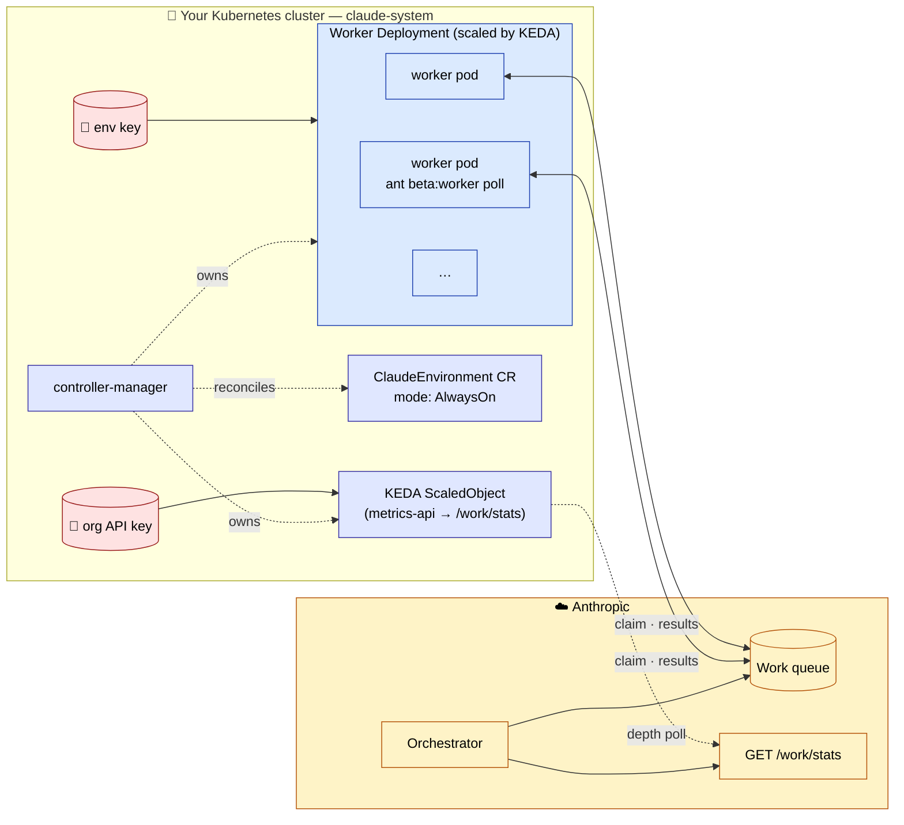
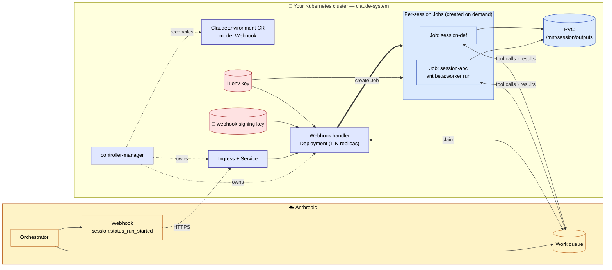

# claude-sandbox-controller (CSC)

> A Kubernetes controller for [Anthropic Self-Hosted Sandboxes](https://platform.claude.com/docs/en/managed-agents/self-hosted-sandboxes), modeled after [actions-runner-controller](https://github.com/actions/actions-runner-controller).

**Status:** pre-alpha / design phase.

---

## 1. Problem

Anthropic's Managed Agents can execute tool calls in **self-hosted sandboxes** — workers you run on your own infrastructure that claim sessions from Anthropic's work queue. The Anthropic docs describe two architectures for the worker:

- **Always-on** — a long-running worker that continuously polls the queue.
- **Webhook-triggered** — a handler that wakes on `session.status_run_started`, claims one session, and exits.

Running either on Kubernetes is straightforward in principle, but every org ends up reimplementing the same scaffolding: Secret management, KEDA wiring for queue-depth scaling, webhook ingress + signature verification, per-session pod isolation, output retrieval, and RBAC scoping. CSC packages that scaffolding behind a single `ClaudeEnvironment` CRD.

## 2. Background and prior art

### 2.1 What Anthropic ships

Anthropic provides:

- An `ant` CLI binary with `ant beta:worker poll` (always-on only).
- Pre-built `EnvironmentWorker` helpers in the Python, TypeScript, and Go SDKs (both modes).
- Lower-level `Environments Work` API endpoints if you want to write a worker from scratch.
- Platform-specific integrations for Cloudflare, Daytona, Modal, and Vercel.

**No first-party Kubernetes controller exists.** Anthropic's docs describe a generic "run the worker on your infrastructure" pattern that maps cleanly onto K8s, but no operator/controller has been published by Anthropic or (as far as we can tell) by anyone else.

### 2.2 The closest existing piece

[`kubernetes-sigs/agent-sandbox`](https://github.com/kubernetes-sigs/agent-sandbox) is a SIG-Apps project explicitly framed as "AI Agent Runtimes: Isolated environments for executing untrusted, LLM-generated code." It ships `Sandbox`, `SandboxTemplate`, `SandboxClaim`, and — most relevant — `SandboxWarmPool` for pre-warmed pods.

It doesn't know anything about Anthropic's work queue, but it provides exactly the primitives a Claude-aware controller could drive. **v1 of CSC will not depend on agent-sandbox** (keeping the dependency surface small), but a future version may sit on top of it to inherit warm-pool semantics.

### 2.3 Why this is easier than ARC

ARC (`actions-runner-controller`) carries incidental complexity that doesn't apply here:

| ARC has to deal with                        | Claude sandbox equivalent                              |
| ------------------------------------------- | ------------------------------------------------------ |
| GitHub App auth + token rotation            | One environment key in a Secret                        |
| Webhook delivery + label/group matching     | One queue per environment; one webhook event type      |
| Two coexisting architectures (legacy + scale-sets) | Greenfield                                      |
| Runner registration/deregistration with GitHub | Worker just polls; no registration                  |
| Job-level scheduling semantics              | Sessions are opaque work items                         |

The worker binaries (`ant beta:worker run`, SDK `EnvironmentWorker`) already exist — the controller only owns *lifecycle and scaling*, not execution. Plausible v1 size: a few hundred LOC of Go.

## 3. Goals

- One CRD (`ClaudeEnvironment`) that captures everything needed to run sandboxes for an Anthropic environment.
- Support both **Always-on** and **Webhook-triggered** modes.
- Deployable via plain `kubectl apply -f` manifests **and** via Helm.
- Scale-to-zero in both modes.
- Strict separation between control-plane credentials (org API key) and data-plane credentials (environment key). Data-plane pods only ever see the environment key.

## 4. Non-goals (v1)

- Memory support (Anthropic doesn't support it for self-hosted yet).
- Multi-tenancy across orgs.
- Bedrock / Vertex routing (Claude Platform on AWS doesn't support self-hosted yet).
- Image build pipelines, custom skill caching, GitHub repo mount helpers.
- Replacing or wrapping `kubernetes-sigs/agent-sandbox` (possible future integration).

## 5. Architecture

CSC consists of a controller-manager that reconciles `ClaudeEnvironment` CRs into mode-specific resource trees.

### 5.1 Always-on mode



The controller reconciles `mode: AlwaysOn` into:

- A `Deployment` of worker pods running the worker image (default: `ant beta:worker poll`).
- A KEDA `ScaledObject` whose `metrics-api` trigger polls `/v1/environments/{id}/work/stats` for `depth`.
- A `TriggerAuthentication` referencing the org API key Secret.

Workers run continuously; each pod claims sessions from the queue and runs tool calls in-process. Sessions may share a pod's filesystem sequentially.

### 5.2 Webhook-triggered mode



The controller reconciles `mode: Webhook` into:

- A small `Deployment` + `Service` running the webhook handler (verifies signature, claims one work item, creates a `Job`).
- An optional `Ingress`.
- For each `session.status_run_started` event: a `Job` running the worker image (default: `ant beta:worker run`) with `ANTHROPIC_SESSION_ID`, `ANTHROPIC_WORK_ID`, `ANTHROPIC_ENVIRONMENT_KEY`, `ANTHROPIC_ENVIRONMENT_ID`, `ANTHROPIC_BASE_URL` injected as env vars.

KEDA is not required — the system scales to zero naturally between sessions.

> The handler is **control-plane**: it only dispatches and creates Jobs, it never executes agent code. Agent tool calls only run inside Session Jobs.

### 5.3 CRD shape

```yaml
apiVersion: csc.io/v1alpha1
kind: ClaudeEnvironment
metadata:
  name: prod
  namespace: claude-system
spec:
  environmentId: env_abc123
  environmentKeySecretRef:
    name: prod-env-key
    key: environment-key

  mode: AlwaysOn        # AlwaysOn | Webhook

  workerImage: ghcr.io/<org>/claude-sandbox-worker:v0.1.0

  alwaysOn:
    minReplicas: 0
    maxReplicas: 10
    workdir: /workspace
    podTemplate: {}     # optional PodTemplateSpec
    scaling:
      orgApiKeySecretRef:
        name: anthropic-org-key
        key: api-key
      targetQueueDepth: 1

  webhook:
    signingKeySecretRef:
      name: prod-webhook-signing
      key: signing-key
    ingress:
      enabled: true
      host: claude-webhook.example.com
      annotations: {}
    jobTemplate: {}     # optional PodTemplateSpec
    ttlSecondsAfterFinished: 600

status:
  conditions: []
  observedGeneration: 1
  workerDeploymentName: prod-worker
  webhookServiceName: prod-webhook
  observedQueueDepth: 0
  workersPolling: 0
  lastWebhookReceivedAt: null
```

### 5.4 Component matrix

| Component                                       | Always-on | Webhook |
| ----------------------------------------------- | :-------: | :-----: |
| `controller-manager`                            |     ✓     |    ✓    |
| Worker `Deployment`                             |     ✓     |    –    |
| Webhook handler `Deployment` + `Service`        |     –     |    ✓    |
| Session `Job` (ephemeral)                       |     –     |    ✓    |
| KEDA `ScaledObject` + `TriggerAuthentication`   |     ✓     |    –    |
| Optional `Ingress`                              |     –     |    ✓    |
| Env key Secret                                  |     ✓     |    ✓    |
| Org API key Secret                              |     ✓     |    –    |
| Webhook signing key Secret                      |     –     |    ✓    |

## 6. Design decisions and rationale

Captured here so future contributors don't relitigate.

### 6.1 Two modes match Anthropic's docs

We use the same terminology as the upstream docs (`AlwaysOn`, `Webhook`) rather than inventing our own (e.g. "shared" vs "isolated"). This keeps mental load low when reading Anthropic's docs alongside CSC's.

### 6.2 The poller/dispatcher is control-plane

In Webhook mode the handler **does not execute agent code** — its whole job is to claim a work item and create a Kubernetes Job. That's control-plane behavior by every reasonable definition (it makes scheduling decisions and writes K8s objects via RBAC), the same way `kube-scheduler` is control plane even though the Pods it creates are data plane.

Practical consequences:

- The handler gets **tight RBAC**: create Jobs in one namespace, read one Secret. Nothing else.
- The handler **never touches `/workspace`**, never runs skills, never executes a tool call. A bug there can't exfiltrate user data.
- The handler **scales independently** (1-N replicas with leader election) from Session Jobs (1:1 with sessions).
- Restarting the handler mid-session is fine — Anthropic re-leases the work item after `reclaim_older_than_ms`.

### 6.3 Two distinct credentials pinned to two tiers

| Tier          | Secret                           | Used by              | Scope                                        |
| ------------- | -------------------------------- | -------------------- | -------------------------------------------- |
| Control plane | `ANTHROPIC_API_KEY` (org key)    | controller, KEDA     | Full org — create agents, sessions, envs     |
| Data plane    | `ANTHROPIC_ENVIRONMENT_KEY`      | Workers, Session Jobs | One environment — claim work, post results  |

Anthropic's docs are explicit about this:

> These endpoints authenticate with your organization API key, not the environment key. Call them from outside the worker host. Setting `ANTHROPIC_API_KEY` on the worker host exposes an organization-scoped credential to agent tool calls.

So `/work/stats` (used by KEDA) needs the org key. Workers only need the environment key.

### 6.4 KEDA scales directly via `metrics-api` — no exporter sidecar

The org key is a normal control-plane credential — comparable to ARC's GitHub App private key, cert-manager's DNS tokens, or Crossplane providers' cloud creds. Standard namespace isolation + RBAC + `automountServiceAccountToken: false` on workloads is the accepted bar.

KEDA's `metrics-api` scaler can call `/v1/environments/{id}/work/stats` directly with the org key via `TriggerAuthentication`. A custom Prometheus exporter would only earn its keep for **richer metric shapes** (e.g. scale on `oldest_queued_at` age, or aggregate across many `ClaudeEnvironment` CRs into one dashboard). Defer until v0.2 (observability).

### 6.5 Standard K8s primitives, not custom sandbox CRDs

v1 builds on `Deployment`, `Service`, `Job`, `Ingress`, plus KEDA's CRDs. We deliberately avoid inventing `Sandbox`-style primitives — if we want them later, `kubernetes-sigs/agent-sandbox` already exists and we can integrate (see roadmap).

### 6.6 Webhook handler must use the Anthropic SDK, not `ant`

The `ant` CLI only supports always-on polling. The webhook variant has to use one of the SDKs. Since CSC is in Go, the **Go SDK's `EnvironmentWorker.HandleItem`** is the one-shot per-session call we want.

## 7. v1 scope

**In scope:**

- [ ] `ClaudeEnvironment` CRD (`v1alpha1`) with both modes
- [ ] Controller in Go using kubebuilder / controller-runtime
- [ ] Default worker image based on `ant` CLI
- [ ] Default webhook handler image using the Anthropic Go SDK (`EnvironmentWorker.HandleItem`)
- [ ] KEDA integration for Always-on scaling
- [ ] Helm chart at `charts/claude-sandbox-controller/`
- [ ] Plain manifests at `manifests/install.yaml` (generated via kustomize)
- [ ] Getting Started guide for both modes (kind cluster)
- [ ] E2E tests using `envtest` + a fake Anthropic API
- [ ] Released container images on GHCR
- [ ] CI: lint, unit tests, e2e on kind, image build

**Out of scope for v1:**

- Webhook TLS automation (point at cert-manager)
- Per-namespace tenancy
- Skill prefetching/caching
- Custom metrics beyond queue depth
- Integration with `kubernetes-sigs/agent-sandbox`
- Leader-election tuning (single replica is fine)

## 8. Repo layout

```
.
├── README.md
├── DESIGN.md                       # this file
├── LICENSE
├── Makefile
├── PROJECT                         # kubebuilder
├── go.mod
├── api/v1alpha1/
│   ├── claudeenvironment_types.go
│   └── zz_generated.deepcopy.go
├── cmd/
│   ├── controller/main.go
│   └── webhook-handler/main.go
├── internal/
│   ├── controller/
│   │   ├── claudeenvironment_controller.go
│   │   ├── alwayson.go             # reconcile Deployment + ScaledObject
│   │   ├── webhook.go              # reconcile handler + Ingress
│   │   └── secrets.go
│   └── webhook/
│       ├── handler.go              # signature verify + claim work
│       └── jobspawner.go           # build + apply Job manifest
├── config/                         # kubebuilder kustomize manifests
│   ├── crd/
│   ├── default/
│   ├── manager/
│   ├── rbac/
│   └── samples/
├── charts/claude-sandbox-controller/
│   ├── Chart.yaml
│   ├── values.yaml
│   └── templates/
├── manifests/install.yaml          # generated: `make manifests`
├── images/
│   ├── worker/Dockerfile           # alpine + ant CLI
│   └── webhook-handler/Dockerfile  # distroless + handler binary
├── docs/
│   ├── getting-started-alwayson.md
│   ├── getting-started-webhook.md
│   ├── architecture.md
│   ├── security.md
│   └── reference.md
└── test/
    ├── e2e/
    └── integration/
```

## 9. Deployment

### 9.1 Plain manifests

```bash
kubectl apply -f https://github.com/<org>/claude-sandbox-controller/releases/download/v0.1.0/install.yaml
```

Installs: the CRD, a `claude-system` namespace, controller `Deployment` + RBAC. Does **not** install KEDA.

### 9.2 Helm

```bash
helm install csc oci://ghcr.io/<org>/charts/claude-sandbox-controller \
  --namespace claude-system --create-namespace
```

`values.yaml` exposes:

- Image overrides (controller, worker, webhook-handler).
- Replica count, resource requests/limits.
- KEDA install toggle (default `false` — user installs separately).
- ServiceAccount / RBAC scoping.
- Pod security context.

## 10. Getting Started

### Prerequisites

- Kubernetes v1.28+ (kind, minikube, or a real cluster).
- `kubectl`.
- KEDA installed for Always-on: `helm install keda kedacore/keda -n keda --create-namespace`.
- An Anthropic environment created — see [Anthropic docs](https://platform.claude.com/docs/en/managed-agents/self-hosted-sandboxes).

### Step 1 — Install CSC

```bash
helm install csc oci://ghcr.io/<org>/charts/claude-sandbox-controller \
  --namespace claude-system --create-namespace
```

### Step 2 — Create Secrets

```bash
kubectl -n claude-system create secret generic prod-env-key \
  --from-literal=environment-key=sk-ant-oat01-...

kubectl -n claude-system create secret generic anthropic-org-key \
  --from-literal=api-key=sk-ant-api03-...
```

### Step 3a — Try Always-on mode

```yaml
# alwayson.yaml
apiVersion: csc.io/v1alpha1
kind: ClaudeEnvironment
metadata:
  name: prod
  namespace: claude-system
spec:
  environmentId: env_abc123
  environmentKeySecretRef:
    name: prod-env-key
    key: environment-key
  mode: AlwaysOn
  alwaysOn:
    minReplicas: 0
    maxReplicas: 5
    scaling:
      orgApiKeySecretRef:
        name: anthropic-org-key
        key: api-key
```

```bash
kubectl apply -f alwayson.yaml
kubectl -n claude-system get claudeenvironment prod -w
```

Create a session via the Anthropic API targeting `env_abc123`. KEDA should scale the worker `Deployment` from 0 → 1 within ~30s. Watch:

```bash
kubectl -n claude-system get pods -l csc.io/environment=prod -w
```

### Step 3b — Try Webhook-triggered mode

```bash
kubectl -n claude-system create secret generic prod-webhook-signing \
  --from-literal=signing-key=whsec_...
```

```yaml
# webhook.yaml
apiVersion: csc.io/v1alpha1
kind: ClaudeEnvironment
metadata:
  name: prod
  namespace: claude-system
spec:
  environmentId: env_abc123
  environmentKeySecretRef:
    name: prod-env-key
    key: environment-key
  mode: Webhook
  webhook:
    signingKeySecretRef:
      name: prod-webhook-signing
      key: signing-key
    ingress:
      enabled: true
      host: claude-webhook.example.com
```

```bash
kubectl apply -f webhook.yaml
```

Configure the webhook in the Anthropic Console to point at your Ingress URL. Create a session — a `Job` should appear within seconds.

### Step 4 — Observe

```bash
kubectl -n claude-system describe claudeenvironment prod
kubectl -n claude-system get pods,jobs
kubectl -n claude-system logs -l csc.io/component=worker --tail=100
```

## 11. Security model

- **Org API key** (`ANTHROPIC_API_KEY`) lives in `claude-system`. Only the controller and KEDA's `TriggerAuthentication` reference it. Workers never see it.
- **Environment key** (`sk-ant-oat01-…`) is mounted into worker pods and Session Jobs. Scoped to one environment — can only claim work and post results.
- **Webhook signing key** (`whsec_…`) is mounted into the webhook handler only.
- All worker/Job pods run with `automountServiceAccountToken: false`.
- Controller ServiceAccount has narrow RBAC: read `ClaudeEnvironment` CRs and referenced Secrets; manage `Deployments`, `Services`, `Jobs`, `Ingresses`, `ScaledObjects` in the configured namespace.
- `docs/security.md` ships NetworkPolicy templates (only `api.anthropic.com` egress required from workers).
- Skill code is downloaded at session start and executes arbitrary user-provided code inside the pod. For stronger isolation use gVisor / Kata via `RuntimeClass` (documented, not enforced).

## 12. Operational requirements (from Anthropic docs)

These are fixed by the worker binary and SDK helpers — pin them in image builds and CRD validation:

- **`/bin/bash` at that exact path** is required by both CLI and SDK workers. `PATH` overrides don't help. Distroless base images won't work for worker pods.
- The **TypeScript SDK helper** additionally requires `unzip`, `tar`, and **Node.js 22+** at fixed paths. (CSC's default worker uses the `ant` CLI / Go SDK, so this only matters if users swap in a TS-based worker image.)
- Default working directory is **`/workspace`**. Skills download to `/workspace/skills/<name>/`. Override via `--workdir` on `ant` or `workdir` field on SDK helpers — and update the agent's system prompt to match.
- Final session outputs land at **`/mnt/session/outputs`**. CSC mounts a PVC there in Webhook mode.
- Worker auth: **environment key** via `ANTHROPIC_ENVIRONMENT_KEY` (Bearer / `auth_token`).
- Stats / stop endpoints: **org API key** via `x-api-key`. Pin `anthropic-version: 2023-06-01` and `anthropic-beta: managed-agents-2026-04-01` headers.
- Memory is **not yet supported** with self-hosted sandboxes.
- Self-hosted sandboxes are **not available** on Claude Platform on AWS.

## 13. Open questions

- Should CSC install KEDA itself? Leaning **no** — opinionated infra deps are unfriendly to brownfield clusters.
- One CR per environment, or a `ClaudeEnvironmentSet`? v1 ships 1:1; sets later.
- Default worker image — minimal (just `ant`) or batteries-included (Node, Python, etc.)? v1 ships minimal + a documented layering pattern.
- Output retrieval — PVC in v1; object-storage hook later?
- Do we need a reaper for stalled work items? Anthropic re-leases after `reclaim_older_than_ms`, so probably not for v1.

## 14. Future roadmap

| Version | Theme                              | Highlights                                                                          |
| ------- | ---------------------------------- | ----------------------------------------------------------------------------------- |
| v0.2    | Observability                      | Prometheus metrics on controller + workers: queue depth, workers polling, session duration, success/failure rates |
| v0.3    | Per-session isolation in Always-on | Support `--on-work` script mode so each session gets its own pod even without webhook |
| v0.4    | `agent-sandbox` integration        | Borrow Session pods from a `SandboxWarmPool` for sub-second cold starts             |
| v0.5    | MCP tunnels                        | Sidecar pattern to expose private MCP servers to sessions                           |
| v0.6    | `ClaudeEnvironmentSet`             | Manage many environments from one CR; rolling key rotation                          |
| v0.7    | Workload identity                  | Replace static Secrets with IRSA / GCP WI / Azure WI where possible                 |
| v1.0    | Stability                          | API graduates to `v1`; conformance suite against `ant beta:worker` reference behavior |

## 15. Implementation notes for the first contributor

A few things to flag before code starts landing:

- **Kubebuilder vs Operator SDK** — both work. Kubebuilder is lighter scaffolding. If your team already uses Operator SDK elsewhere, stick with it.
- **CRD group name** — `csc.io` is a placeholder. Use a domain you control, e.g. `claudesandbox.<yourdomain>` or `csc.<yourdomain>`.
- **Pin the `ant` version** in `images/worker/Dockerfile` (`v1.9.1` at time of writing) so worker behavior is reproducible. Bump deliberately.
- **`anthropic-beta` header** — currently `managed-agents-2026-04-01`. The controller should expose this as a constant in one place so we can roll it forward.
- **Webhook handler can't use `ant`** — has to be the Go SDK. Use `EnvironmentWorker.HandleItem` for the single-claim flow.
- **Worker pod base image** — must include `/bin/bash`. `alpine` works (add `bash` package); `distroless` doesn't.

## 16. References

- [Anthropic — Self-hosted sandboxes](https://platform.claude.com/docs/en/managed-agents/self-hosted-sandboxes)
- [Anthropic — Environments Work API](https://platform.claude.com/docs/en/api/beta/environments/work)
- [Anthropic — Managed Agents overview](https://platform.claude.com/docs/en/managed-agents/overview)
- [actions-runner-controller](https://github.com/actions/actions-runner-controller) (architectural reference)
- [kubernetes-sigs/agent-sandbox](https://github.com/kubernetes-sigs/agent-sandbox) (possible future integration)
- [KEDA metrics-api scaler](https://keda.sh/docs/latest/scalers/metrics-api/)
- [kubebuilder](https://book.kubebuilder.io/)
